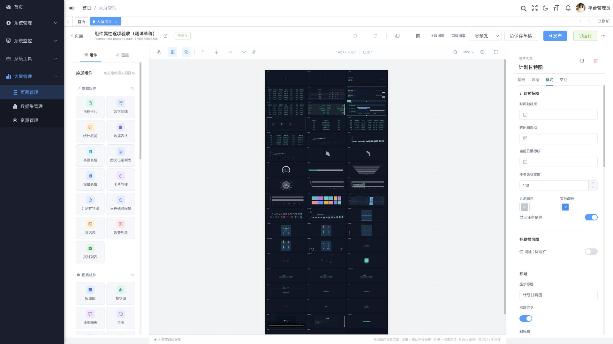
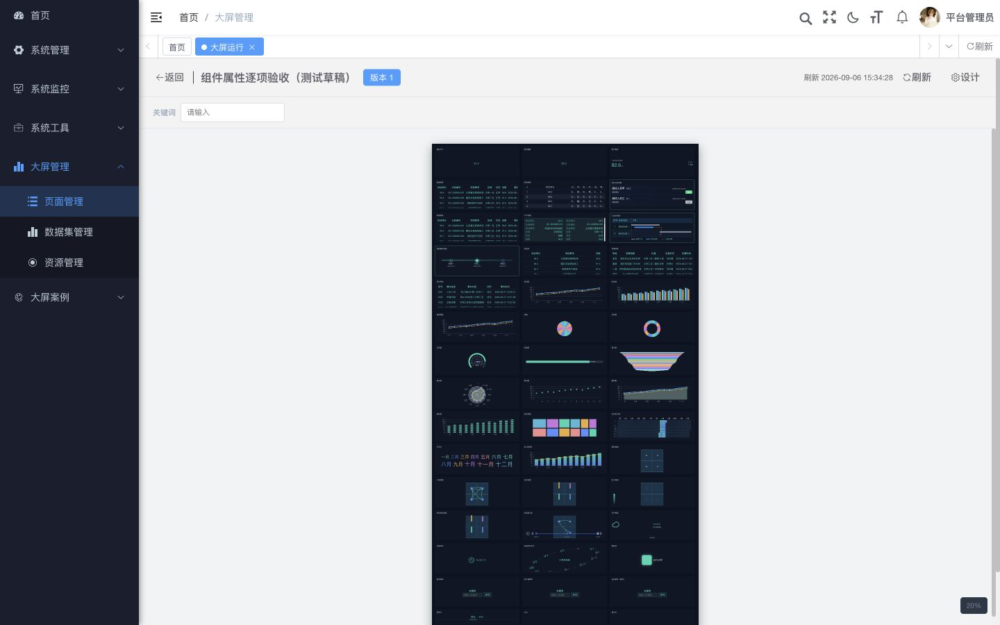
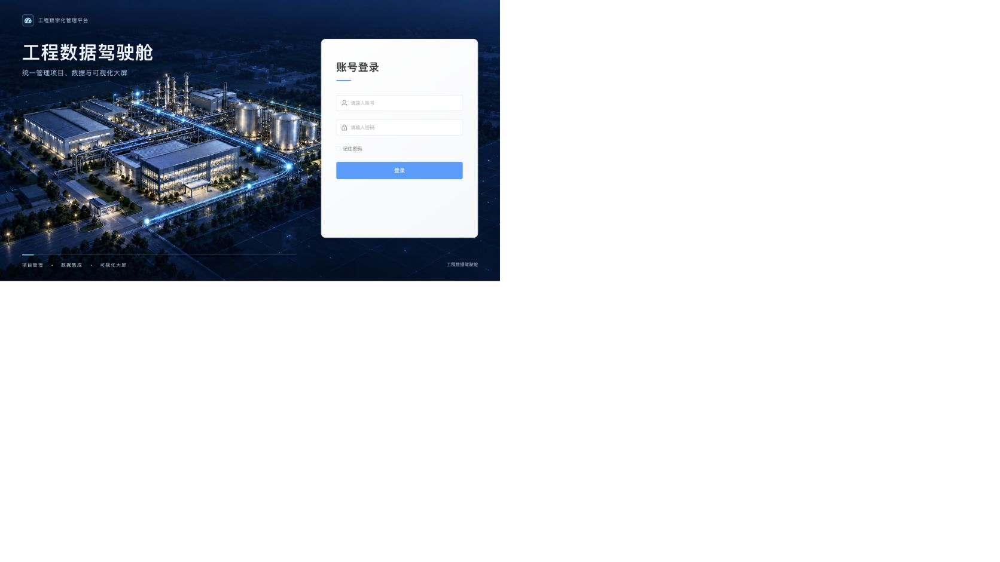

# 工程数据驾驶舱

[](ruoyi-backend/LICENSE) [](https://vuejs.org/) [](https://www.oracle.com/java/technologies/javase/jdk17-archive-downloads.html)

基于 RuoYi-Vue 的配置式工程数据可视化平台。通过数据源、数据集和页面版本，把 SQL、HTTP API、JSON 或 WebSocket 数据绑定到可视化大屏，支持拖拽设计、发布回滚、登录运行和只读分享。

> 本项目负责数据接入、配置、校验和可视化，不替代业务系统的录入、审批、主数据维护或设备采集。外部来源、字段口径、权限和生产容量需要在目标环境单独验收。

## 功能

- **可视化设计器**：53 类白名单组件，支持拖动、缩放、旋转、网格吸附、对齐分布、图层排序、分组、锁定、复制粘贴、撤销重做、JSON 导入导出和组件预览。
- **数据管理**：分层管理数据源与数据集，支持 SQL、HTTP、静态/远程 JSON 和 WebSocket；服务端校验参数、字段映射、缓存、超时、并发和数据质量。
- **页面生命周期**：文件夹、复制、回收站、草稿、发布、历史版本、回滚、菜单入口和多页面集合。
- **运行与分享**：登录运行、全屏、自适应、多页跳转、定时刷新和实时推送；分享链接支持页面集合、版本绑定、过期和撤销。
- **资源与内容**：图片、视频、标题图、GeoJSON、富文本、受控表单、平台内嵌页面和沙箱自定义内容。
- **第三方接入**：出站 HTTP endpoint、受控媒体代理、版本化入站 API、API Key/Bearer/HMAC、幂等台账、死信重放、保留期和运维告警。
- **平台能力**：沿用 RuoYi 的登录、角色、菜单、按钮权限、字典、操作日志和 Redis 基础设施。

## 技术栈

| 层 | 技术 |
| --- | --- |
| 前端 | Vue 3、Vite、Element Plus、ECharts、Pinia、Axios |
| 后端 | Java 17、Spring Boot 4、MyBatis、Spring Security、Spring WebSocket |
| 平台 | RuoYi 3.9.2、MySQL 8+、Redis 6+、可选 Nginx |

`ruoyi-ui/` 是前端，`ruoyi-backend/` 是 Maven 多模块后端。大屏业务直接集成在 `ruoyi-admin` 和 `ruoyi-system`。

## 快速开始

### 环境要求

Git、JDK 17+、Maven、Node.js 22+、pnpm、MySQL 8+ 和 Redis 6+。维护脚本还需要 `curl`、`jq`、`mysql`、`redis-cli`、`lsof` 等常用命令。

### 配置与启动

```bash
git clone https://github.com/WuZhaohui1993/engineering-data-cockpit.git
cd engineering-data-cockpit
cp config/ruoyi-local.env.example config/ruoyi-local.env
```

编辑被 Git 忽略的 `config/ruoyi-local.env`，填写本地 MySQL、Redis 和上传目录配置。禁止提交密码、Token、数据源凭证或密钥；生产环境应显式设置固定的 `TOKEN_SECRET` 与 `DASHBOARD_DATASOURCE_ENCRYPTION_KEY`。

```bash
# 首次准备专用本地库时执行
./scripts/init-local-mysql.sh

pnpm --dir ruoyi-ui install --frozen-lockfile
mvn -f ruoyi-backend/pom.xml -DskipTests package

# 开发环境分别启动前后端
./scripts/start-backend.sh
./scripts/start-frontend.sh
```

浏览器访问 <http://127.0.0.1:5173>，后端就绪检查为 `GET http://127.0.0.1:8080/captchaImage`。初始化脚本会写入 RuoYi 基础表和虚构示例数据，只能用于专用本地库；其中包含仅供本地演示的 `admin/test` 初始账号数据，首次登录后必须立即修改或删除，严禁用于生产。

## 测试

```bash
node --test ruoyi-ui/tests/*.test.mjs
npm --prefix ruoyi-ui run build:prod
mvn -f ruoyi-backend/pom.xml test
mvn -f ruoyi-backend/pom.xml -DskipTests package
git diff --check
```

全栈和第三方接入专项命令见[本地测试指南](docs/本地测试指南.md)。静态测试、构建、数据库回归和浏览器验收属于不同层级，生产部署前请按[测试与已知限制](docs/测试与已知限制.md)复测。

## 界面预览

以下截图来自脱敏的本地演示数据，用于展示管理外壳、设计器和登录页布局。

| 管理外壳与设计器 | 运行页面 | 登录页 |
| --- | --- | --- |
|  |  |  |

## 在线演示

- 演示地址：<http://43.156.229.191>
- 演示账号：请向项目维护者申请临时只读账号。
- 演示密码：不写入公开仓库，通过私下渠道提供并定期轮换。

该地址的访问受服务器网络、安全组和演示环境状态影响；README 不承诺持续可用性。请勿向演示环境提交真实业务数据。

## 文档

完整索引见[文档目录](docs/文档目录.md)。常用入口：

- [架构总览](docs/架构总览.md)
- [大屏设计器设计](docs/大屏设计器设计.md)
- [数据集与数据源设计](docs/数据集与数据源设计.md)
- [数据接入管理与保留策略](docs/数据接入管理与保留策略.md)
- [第三方数据接入需求](docs/第三方数据接入需求.md)
- [权限与接口设计](docs/权限与接口设计.md)
- [安全与许可证](docs/安全与许可证.md)
- [示例数据](docs/examples/README.md)

## 项目结构

```text
├── ruoyi-ui/          # Vue 前端、设计器、运行页和组件
├── ruoyi-backend/     # Spring Boot 多模块后端及 SQL
├── config/            # 本地配置模板
├── database/backups/  # 脱敏数据库快照和校验清单
├── scripts/           # 启动、初始化、审计和回归脚本
└── docs/              # 架构、配置、开发和验证文档
```

## 安全边界

默认出站 HTTP 使用 HTTPS、主机白名单和地址校验；SQL 数据集只允许只读预编译查询；分享和入站接口分别执行令牌/版本范围校验与认证、幂等和防重放。当前页面未实现项目/部门行级 ACL；公网部署还需配置 HTTPS、反向代理、密钥管理、备份恢复、漏洞扫描和容量监控。详见[安全与许可证](docs/安全与许可证.md)。

## 参与贡献

欢迎提交 Issue 和 Pull Request。提交前请阅读 [贡献指南](CONTRIBUTING.md)，保持前后端接口、权限和菜单同步；不要提交凭证、真实业务数据、完整分享令牌或生产配置；在 PR 中说明实际运行的测试及未覆盖范围。

## 许可证

本项目沿用 RuoYi 的 MIT 许可证文本，许可证文件见 [`ruoyi-ui/LICENSE`](ruoyi-ui/LICENSE) 和 [`ruoyi-backend/LICENSE`](ruoyi-backend/LICENSE)。第三方依赖的许可证与版权声明须按实际分发内容核对。
